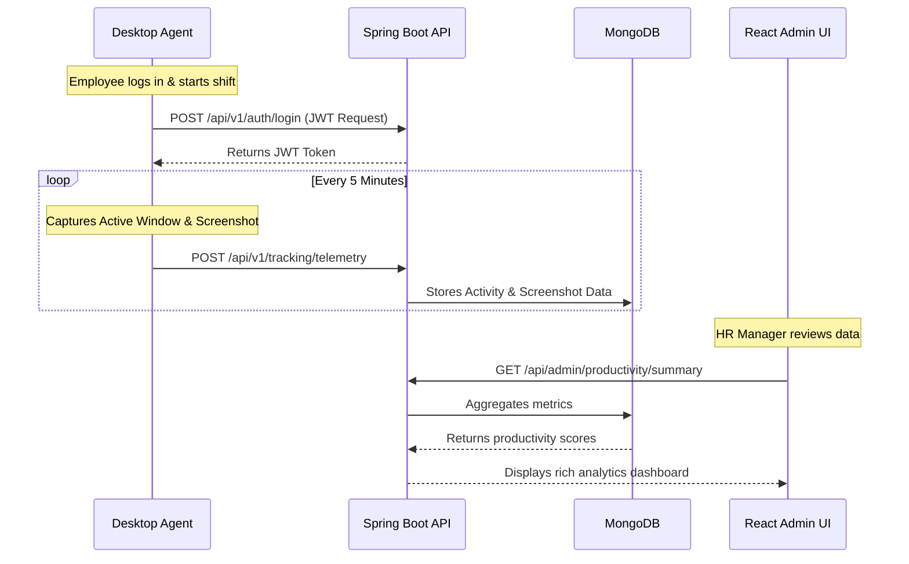

<div align="center">
  
  <h1>Employee Monitoring System (EMS 3.0)</h1>
  <p><em>An enterprise-grade platform for remote workforce management, productivity tracking, and intelligent analytics.</em></p>
</div>

<br />

The **Employee Monitoring System (EMS 3.0)** is a full-stack monorepo designed to help organizations manage distributed teams efficiently. It provides deep insights into employee productivity through real-time desktop monitoring, automated timesheets, application activity tracking, and organizational hierarchy management.

---

## 🏗️ Architecture & Modules

The platform is divided into three core subsystems, designed to work seamlessly together:

### 1. 🖥️ Admin Dashboard (`/admin-ui`)
A modern, reactive single-page application built for HR managers and Administrators.
- **Tech Stack:** React 18, Vite, TypeScript, Tailwind CSS, Lucide Icons.
- **Features:** Real-time dashboards, organization hierarchy (Departments & Teams), timesheet approvals, employee productivity scoring, and a secure interface for reviewing desktop screenshots.

### 2. ⚙️ Core Backend API (`/employee`)
The central nervous system of EMS 3.0, providing secure RESTful APIs and real-time data ingestion.
- **Tech Stack:** Java 17, Spring Boot 3, Spring Security (JWT), MongoDB.
- **Features:** Role-based access control (RBAC), robust data aggregation for productivity metrics, OTA update orchestration, and scalable event processing for agent telemetry.

### 3. 🛡️ Desktop Agent (`/employee-agent`)
A lightweight, resilient desktop client that runs silently on employee workstations.
- **Tech Stack:** Java 17, AWT/Swing (System Tray), Windows API integration.
- **Features:** Active window tracking, automated idle detection, periodic screenshot capturing, offline data caching, and self-updating capabilities (OTA).

---

## 🔄 System Workflow & Data Pipeline

The following diagram illustrates how data flows securely from the employee's machine to the administrator's dashboard.



---

## 🚀 Quick Start Guide

### Prerequisites
- **Java 17+** (For Backend and Agent)
- **Node.js 18+** (For Admin UI)
- **MongoDB 6.0+** (Local or Atlas cluster)
- **Maven** (For building Java projects)

### 1. Start the Backend API
```bash
cd employee
# Ensure your MongoDB is running on localhost:27017 or configure application.properties
mvn clean install
mvn spring-boot:run
```
*The server will start on `http://localhost:8080`*

### 2. Launch the Admin Dashboard
```bash
cd admin-ui
npm install
npm run dev
```
*The UI will be available at `http://localhost:5174`*

### 3. Run the Desktop Agent (Development Mode)
```bash
cd employee-agent
mvn clean install
mvn exec:java -Dexec.mainClass="org.example.AgentApplication"
```

---

## 🔐 Security & Privacy
EMS 3.0 is built with security at its core:
- All telemetry is transmitted over **HTTPS/TLS**.
- API endpoints are secured using **Stateless JWT Authentication**.
- Sensitive endpoints require explicit `ROLE_ADMIN` permissions.
- Screenshots are securely stored and only accessible by authorized managers.

---

## 📦 Deployment
- **Backend:** Can be containerized via Docker and deployed to AWS ECS / Heroku.
- **Frontend:** Built via `npm run build` and deployable to Vercel, Netlify, or Nginx.
- **Agent:** The `packaging/` directory contains PowerShell scripts (`build-msi.ps1`) to compile the agent into a native Windows Installer (`.msi`) using `jpackage`.
